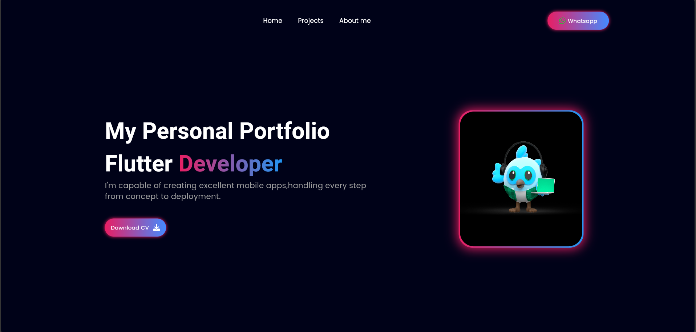
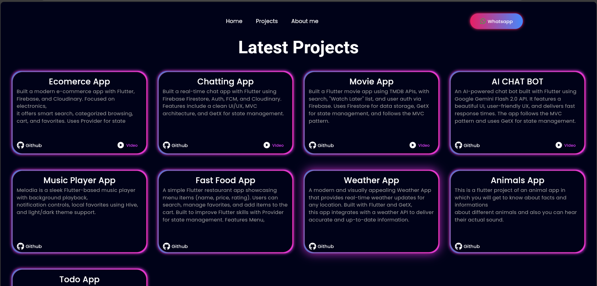
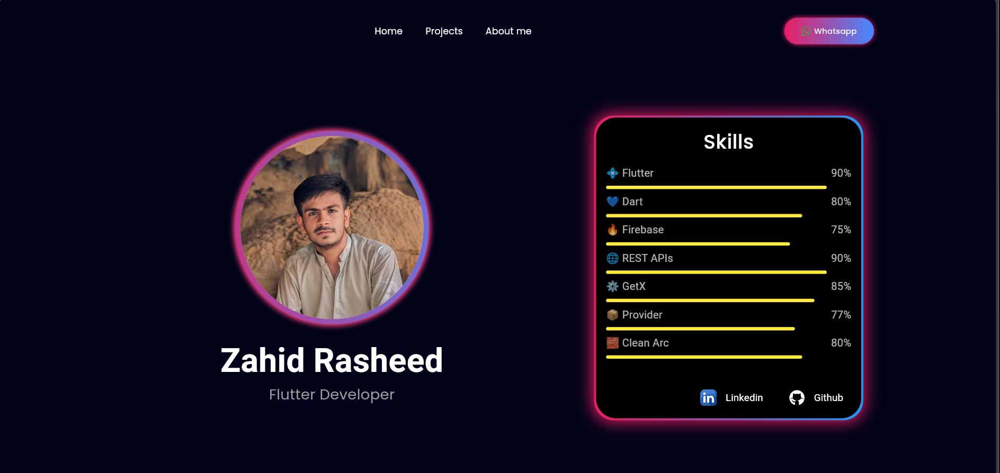

# 🌟 Responsive Portfolio App

I built a **responsive Flutter portfolio** using **GetX** ⚡ with **custom animated routing** 🎬 for smooth navigation.  
The modern UI 🎨 adapts to all screen sizes 📱💻 using **MediaQuery** and **LayoutBuilder** 🛠 for dynamic layouts, and it features engaging animations ✨ throughout.  
It showcases my **skills**, **projects**, and **contact details** in a clean, professional, and visually appealing layout.

## 🚀 Features
- 📱 **Responsive Design** – Built using **MediaQuery** and **LayoutBuilder** for adaptive UI on mobile, tablet, and desktop.
- ⚡ **GetX State Management** – Efficient and simple navigation.
- 🎬 **Custom Animated Routing** – Smooth transitions between pages.
- ✨ **Interactive Animations** – Engaging UI animations throughout.
- 🎨 **Modern UI** – Professional and clean design.

## 🖼 Screenshots
| 🏠 Home Screen | 📂 Projects Screen | 📧 Contact Screen               |
|---------------|------------------|---------------------------------|
|  |  |  |

## 🛠 Tech Stack
- 🐦 Flutter
- ⚡ GetX
- 💙 Dart
- 📏 MediaQuery
- 🖼 LayoutBuilder 